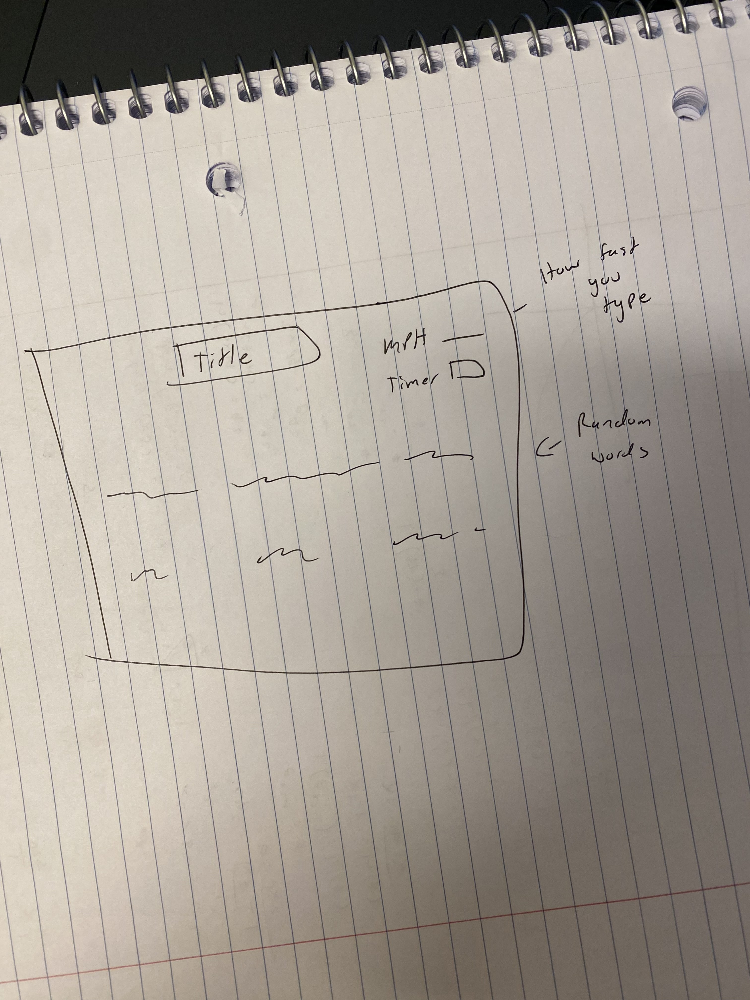
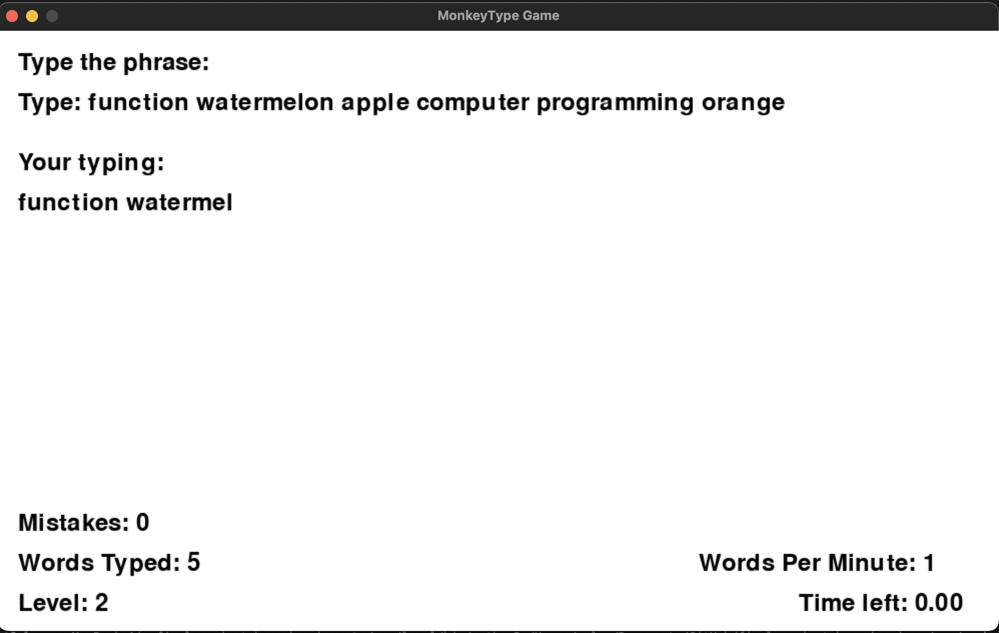

# Typewriter Game
## CS110 Final Project  Fall, 2023

## Team Members

Coleman Tang
Ryan Wong

***

## Project Description

This project is a speed typing game where the user types the words given on the screen as fast as they can in a given time and is given the result of their typing speed.
***    

## GUI Design

### Initial Design

### Final Design

## Program Design

### Features

1. Start menu is the screen where everything resets with an updated score if played before.
2. Timer is where there is a timer counting down when the game starts
3. Keyboard is the output of the player typing and it shows on the screen whether they have type the word correctly if not it will show red and not continue until they type the word right.
4. Calculating speed of the user speed. This feature calculates how fast the user type in mph.
5. Game over screen. This is when the timer stops and shows the result of the user typing speed and ask the user if they want to play again.

### Classes

- << You should have a list of each of your classes with a description >>
Main. This is the start of the screen and uses the other classes to run the game.
Timer. This is the timer in the game.
Keyboard. This is where the it reads the user typing.
Calculating. This is where it calculated the user speed.

## ATP
Program: Typewriter Game

Test Case 1: Typing Accuracy

Test Description: Verify that typed characters appear accurately on the screen.
Test Steps:
Start the game.
Type a sequence of characters.
Verify that each typed character appears correctly on the screen.
Expected Outcome: Typed characters should accurately appear on the screen without errors or omissions.

Test Case 2: Typing Speed

Test Description: Test the game's ability to measure typing speed.
Test Steps:
Start the game.
Type a given passage within a specified time limit.
Verify that the game accurately records the number of characters typed per minute (CPM).
Expected Outcome: The game should measure typing speed by accurately calculating CPM within the set time limit.

Test Case 3: Error Tracking

Test Description: Confirm that the game tracks typing errors.
Test Steps:
Start the game.
Intentionally make typing errors while entering a passage.
Verify that the game detects and displays the number of errors made.
Expected Outcome: The game should track and display the number of typing errors made during gameplay.

Test Case 4: Progression and Levels

Test Description: Ensure that the game progresses through levels correctly.
Test Steps:
Start the game.
Complete a level by typing the given passage within the time limit.
Verify that the game progresses to the next level or displays a level completion message.
Expected Outcome: The game should smoothly progress to the next level upon successful completion of the current level.

Test Case 5: User Interface and Navigation

Test Description: Test the usability of the game's user interface and navigation.
Test Steps:
Start the game.
Navigate through menus (Start Game, Options, High Scores, Quit).
Verify that each option is selectable and leads to the expected actions.
Expected Outcome: The game's menus should be navigable, and options should function as intended.

